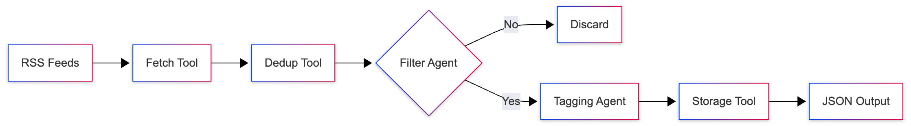

# AI News Aggregator & Curator Agent

## 1. Problem Statement
In the rapidly evolving world of Artificial Intelligence, staying updated is a challenge. Developers and researchers are bombarded with hundreds of articles daily from various sources. Manually sifting through RSS feeds to find high-quality, relevant AI news is time-consuming and inefficient. Information overload leads to missed updates and wasted time.

This project solves this by automating the discovery, filtering, and categorization of AI news. It matters because it allows professionals to focus on reading what's important rather than searching for it.

## 2. Why Agents? / Solution Statement
Traditional keyword-based filtering is brittle; it misses context and often produces false positives. **Agents** are the right approach because they can reason about content. They can understand nuance—distinguishing between a generic tech article and a deep dive into LLM architectures.

**Our Solution**: A **Hybrid Tool Pipeline** that combines the efficiency of deterministic tools with the cognitive power of LLMs.
-   **Tools** handle high-volume data processing (fetching, deduplication).
-   **Agents** handle semantic understanding (filtering, tagging).

## 3. Value Statement
**What users gain:**
-   **Time Savings**: Automated curation replaces manual searching.
-   **Relevance**: High-precision filtering ensures you only see AI-related content.
-   **Organization**: Automatic tagging makes it easy to browse by topic (e.g., "LLMs", "Computer Vision").
-   **Scalability**: Easily add more feeds without increasing manual workload.

## 4. Architecture Overview
The system follows a linear pipeline architecture orchestrated by a central runner.

### Design
1.  **Ingestion**: Fetch raw RSS feeds.
2.  **Preprocessing**: Deduplicate articles using fuzzy matching (`rapidfuzz`) to handle cross-posting.
3.  **Intelligence Layer**:
    -   **Filter Agent**: Analyzes title and summary to decide "Is this AI news?"
    -   **Tagging Agent**: If relevant, assigns specific tags based on content.
4.  **Storage**: Saves processed articles to a structured JSON file.

### Diagram


## 5. Project Structure
Key components for developers:

```
./
├── main.py                 # Entry point for the pipeline
├── requirements.txt        # Project dependencies
├── src/
│   ├── pipeline.py         # HybridToolPipeline orchestrator
│   ├── agents/             # Agent definitions
│   │   ├── filter_agent.py     # Determines AI relevance
│   │   ├── tagging_agent.py    # Assigns topics
│   │   └── processing_pipeline.py # Composes agents
│   ├── tools/              # Deterministic utilities
│   │   ├── fetch_rss.py        # RSS fetcher (feedparser)
│   │   ├── dedup.py            # Deduplication logic
│   │   └── storage.py          # File I/O
│   ├── models/             # Pydantic data models
│   └── utils/              # Logging and JSON helpers
└── data/                   # Output directory for processed news
```

## 6. Essential Tools and Utilities / The Build
This system is built using a modern Python stack focused on reliability and agentic capabilities.

*   **Libraries**:
    *   `feedparser`: Robust parsing of RSS/Atom feeds.
    *   `google-adk`: The **Agent Development Kit** provides the framework for creating, running, and orchestrating agents.
    *   `google-genai`: Interface for Gemini models.
    *   `rapidfuzz`: Fast string matching for deduplication.
    *   `pydantic`: Data validation to ensure structured agent outputs.

*   **Agents**:
    *   Built using `google-adk`'s `ModelClient` and `Agent` interfaces.
    *   Prompts are designed to return structured JSON for reliable downstream processing.

*   **Supporting Utilities**:
    *   **Logging**: A custom `LoggingPlugin` integrates with the agent runner to provide visibility into agent reasoning.
    *   **Retry Logic**: Built-in exponential backoff for API resilience.

*   **Databases**:
    *   Currently uses a file-based JSON storage for simplicity and portability (`data/ai_articles.jsonl`).

*   **Infrastructure Choices**:
    *   **AsyncIO**: The pipeline runs asynchronously to handle multiple feeds and API calls concurrently.
    *   **Environment Variables**: Configuration (API keys) managed via `.env`.

## 7. Workflow
The end-to-end pipeline executes as follows:

1.  **Fetch**: The `fetch_rss` tool pulls the latest items from configured URLs (e.g., TechCrunch, Google Blog).
2.  **Dedup**: The `dedup` tool compares new articles against a history of seen URLs and titles to prevent duplicates.
3.  **Filter**: The `FilterAgent` examines the article.
    *   *Input*: Title, Summary.
    *   *Decision*: "Is this about AI/ML?"
4.  **Tag**: If approved, the `TaggingAgent` analyzes the content.
    *   *Output*: List of tags (e.g., ["Generative AI", "LLM"]).
5.  **Store**: The `storage` tool appends the enriched article object to the persistent store.
6.  **Output**: The final result is a clean list of AI news items ready for consumption.

### Example Run
```bash
$ python main.py
```

### Console Output Snippet
```text
2025-12-01 02:20:29 - root - INFO - ================================================================================
2025-12-01 02:20:29 - root - INFO - Logging initialized at 2025-12-01 02:20:29
2025-12-01 02:20:29 - root - INFO - ================================================================================
2025-12-01 02:20:29 - google_adk.google.adk.plugins.plugin_manager - INFO - Plugin 'logging_plugin' registered.
2025-12-01 02:20:29 - src.pipeline - INFO - Starting Hybrid Tool Pipeline...
2025-12-01 02:20:29 - src.pipeline - INFO - Processing 1 RSS feeds...
2025-12-01 02:20:29 - src.pipeline - INFO - === Phase 1: Fetch & Dedup (per-feed processing) ===
2025-12-01 02:20:30 - src.tools.fetch_rss - INFO - Fetched 10 items from https://www.databricks.com/feed
2025-12-01 02:20:30 - src.pipeline - INFO - Deduplicating feed: https://www.databricks.com/feed
2025-12-01 02:20:30 - src.pipeline - INFO - Fetched 10 raw items
2025-12-01 02:20:30 - src.pipeline - INFO - Unique articles from https://www.databricks.com/feed: 10
2025-12-01 02:20:30 - src.pipeline - INFO - === Phase 2: Filter & Tag ===
2025-12-01 02:20:30 - src.pipeline - INFO - Processing all articles.
2025-12-01 02:20:30 - src.pipeline - INFO - Processing 10 articles (concurrency=3)...
2025-12-01 02:20:31 - src.pipeline - INFO - ✓ AI-related: Claude Opus 4.5 Is Here
2025-12-01 02:20:31 - src.pipeline - INFO - ✗ Not AI-related: From Blind Spots to Real-Time Intelligence: How Location Data from O2 Motion is Transforming Business Decision-Making - The article discusses location data and business decision-making, but does not contain any keywords related to AI.
2025-12-01 02:20:32 - src.pipeline - INFO - ✗ Not AI-related: A Year of Interoperability: How Enterprises Are Scaling Governance with Unity Catalog - The article discusses data governance and enterprise scaling using Unity Catalog. While data platforms often underpin AI/ML initiatives, the keywords and core topic of the article do not directly relate to AI, machine learning, or related technologies.
2025-12-01 02:20:33 - src.pipeline - INFO - ✗ Not AI-related: Databricks Named a Leader in 2025 Gartner® Magic Quadrant™ for Cloud Database Management Systems - The article discusses Databricks being named a leader in cloud database management systems. While Databricks is known for its AI and machine learning platform, the article itself focuses on database management and doesn't explicitly mention AI or related keywords.
2025-12-01 02:20:34 - src.pipeline - INFO - ✓ AI-related: Building the Future of AI Agents and Intelligence Apps: Celebrating 4 years of Databricks Seattle R&D
2025-12-01 02:20:34 - src.pipeline - INFO - ✓ AI-related: Redefining the Data Warehouse for the AI Era with Azure Databricks
2025-12-01 02:20:35 - src.pipeline - INFO - ✗ Not AI-related: Databricks and AWS Partner to Simplify Infrastructure Setup - The article discusses infrastructure setup and partnership between Databricks and AWS, but does not mention AI, machine learning, or related keywords.
2025-12-01 02:20:45 - src.pipeline - INFO - ✓ AI-related: How to Build Production-Ready Data and AI Apps with Databricks Apps and Lakebase
2025-12-01 02:20:46 - src.pipeline - INFO - ✓ AI-related: The New Way to Build Pipelines on Databricks: Introducing the IDE for Data Engineering
2025-12-01 02:20:46 - src.pipeline - INFO - ✓ AI-related: Databricks Partners with Microsoft to bring our Data Intelligence Platform to Azure Government
2025-12-01 02:20:46 - src.pipeline - INFO - Storing 6 articles...
2025-12-01 02:20:46 - src.pipeline - INFO - ✅ Pipeline Complete!
2025-12-01 02:20:46 - src.pipeline - INFO - Unique fetched articles: 10
2025-12-01 02:20:46 - src.pipeline - INFO - AI-related articles stored: 6
```

## 9. Installation

### Prerequisites
-   Python 3.10+
-   A Google Gemini API Key

### Setup
1.  **Clone the repository**:
    ```bash
    git clone <repo-url>
    cd multi-agent-system
    ```

2.  **Create a virtual environment**:
    ```bash
    python -m venv venv
    source venv/bin/activate  # On Windows: venv\Scripts\activate
    ```

3.  **Install dependencies**:
    ```bash
    pip install -r requirements.txt
    ```

4.  **Configure Environment**:
    Create a `.env` file in the root directory:
    ```env
    GOOGLE_API_KEY=your_api_key_here
    ```

5.  **Run**:
    ```bash
    python main.py
    ```

## 10. Conclusion
This project demonstrates the power of **Agentic Workflows**. By combining simple scripts with intelligent agents, we've turned a noisy firehose of information into a clean, valuable stream of knowledge. It showcases how `google-adk` can be used to build practical, real-world AI applications.

## 11. If I Had More Time…
Future improvements to explore:
*   **Vector Database**: Replace JSON storage with a vector DB (e.g., Chroma, Pinecone) to enable semantic search over the news.
*   **User Interface**: Build a web dashboard (Streamlit or React) to view and search the news.
*   **Personalization**: Add a "User Preferences" agent that learns from what articles you click on.
*   **Multi-Modal**: Analyze images and videos within the articles.
*   **More Sources**: Integrate Twitter/X, Reddit, and arXiv APIs.
